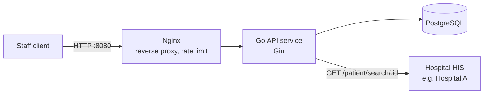
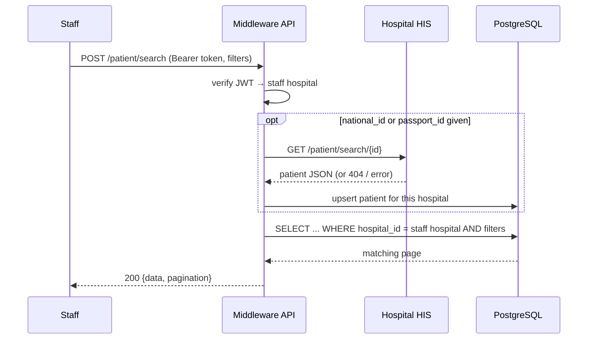
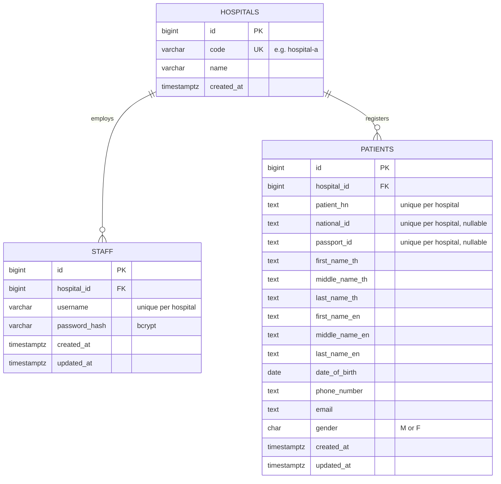

# Hospital Middleware — Development Plan

A middleware API that lets hospital staff search patient records coming from their hospital's
Hospital Information System (HIS). Every staff member belongs to one hospital and can only see
that hospital's patients.

**Stack:** Go 1.27 · Gin · PostgreSQL 17 · Nginx · Docker Compose

---

## 1. Architecture



Inside the API service the dependencies point one way only:

```
handler (HTTP: bind, validate, map to JSON)
   └─> service (business rules)
         ├─> repository (PostgreSQL via pgx)
         └─> his (HIS client per hospital)
domain (entities + errors) is used by every layer and imports nothing.
```

Each layer depends on small interfaces declared by its consumer, so every layer is unit-tested with fakes.

### Patient search flow



The HIS can only be queried by `national_id` or `passport_id`, while staff must also be able to search by name,
date of birth, phone and email. The middleware therefore keeps its own copy of patient records (`patients`),
and the HIS stays the source of truth whenever it can be asked:

| What the HIS answers to an identity number | What the search returns |
|---|---|
| The patient | The record is stored or refreshed first (in one transaction), so the answer is current |
| `404 Not Found` | Nothing for that identity number — any local copy of it is stale |
| Error or slower than `HIS_TIMEOUT` (3 s) | The local copy, with a warning in the log — an HIS outage does not block staff |
| A record the middleware cannot store | `500`, rather than a misleading "no match" |

**Known limitation:** a search by name, date of birth, phone or email only finds patients the middleware has
already received from the HIS (through a search by identity number, or the demo seed). A production deployment
would keep the copy complete with an HIS bulk export or change feed; that integration is outside this assignment.

---

## 2. Project Structure

```
hospital-middleware/
├── cmd/
│   ├── api/              # Service entry point: config, DB pool, migrations, wiring, HTTP server
│   └── mockhis/          # Mock "Hospital A" HIS used by docker compose and demos
├── internal/
│   ├── apierror/         # One JSON error envelope for every endpoint
│   ├── auth/             # bcrypt password hashing, JWT issue/verify
│   ├── config/           # Environment-based configuration and start-up warnings
│   ├── demodata/         # Synthetic demo patients (seed + mock HIS)
│   ├── domain/           # Entities, sentinel errors, identity-number normalisation (no dependencies)
│   ├── handler/          # Gin handlers: binding, validation, response DTOs
│   ├── his/              # HIS client interface, HTTP adapter, per-hospital registry
│   ├── middleware/       # Bearer-token authentication
│   ├── repository/       # PostgreSQL access (pgx) and migration runner
│   ├── router/           # Route table, request logging, panic recovery, body-size limit
│   └── service/          # Business rules: staff onboarding/login, patient search + HIS sync
├── migrations/           # SQL migrations, embedded into the binary
├── tests/e2e/            # End-to-end tests against the running stack through Nginx
├── nginx/nginx.conf      # Reverse proxy, rate limiting, PII-safe logging
├── docs/design.md        # This document
├── Dockerfile            # Multi-stage build of the API and the mock HIS
├── .dockerignore         # Keeps secrets, git history and docs out of the image
├── docker-compose.yml    # nginx + api + postgres + mock-his
├── Makefile
└── .env.example
```

---

## 3. Database Design



| Decision | Reason |
|---|---|
| `staff` unique on `(hospital_id, username)` | Login always includes the hospital, so two hospitals may both have a `nurse01`. |
| `patients` = one row per patient **per hospital** | Each hospital's HIS is the source of truth for its own records and HN. The same person at two hospitals is two rows, and hospital isolation is a simple `WHERE hospital_id = ?`. |
| `patient_hn`, `national_id`, `passport_id` unique per hospital (partial unique indexes for the nullable IDs) | Upserts from the HIS are keyed by `(hospital_id, patient_hn)`. When the HIS moves an identity number to a new HN, the stale row is replaced in the same transaction. |
| `CHECK (national_id IS NOT NULL OR passport_id IS NOT NULL)` | The HIS looks patients up by one of these, so every record must have at least one. |
| Values copied from an HIS are `TEXT` | The middleware must not reject a record because one HIS writes a longer HN or phone number than another. |
| Optional patient fields are nullable | Middle names, passport (for Thai citizens), phone and email are often absent. |
| Lowercase `CHECK` on `hospitals.code` and `staff.username` | Matching is case-insensitive; storing one canonical form keeps the unique constraints honest. |
| `pg_trgm` GIN indexes on the six name columns | Name search is a case-insensitive partial match (`ILIKE '%term%'`), which a B-tree index cannot serve. |

Migrations live in `migrations/` (golang-migrate format) and run automatically on start-up when `RUN_MIGRATIONS=true`.
`hospital-a` and `hospital-b` are seeded as reference data.

---

## 4. API Specification

### Conventions

- Base URL (through Nginx): `http://localhost:8080`
- Request and response bodies are JSON (`Content-Type: application/json`), at most 1 MB.
- Protected endpoints need `Authorization: Bearer <access_token>` from `/staff/login`.
- Dates are `YYYY-MM-DD`; timestamps are RFC 3339 in UTC.
- Optional values that are not available are returned as `null`.
- Every error uses the same envelope; clients should branch on `code`:

```json
{
  "error": {
    "code": "validation_error",
    "message": "request has invalid fields",
    "fields": [{ "field": "password", "message": "must be at least 8 characters" }]
  }
}
```

| HTTP | `code` | When |
|---|---|---|
| 400 | `validation_error` | Missing, invalid or unknown fields, or malformed JSON |
| 400 | `unknown_hospital` | `/staff/create` with a hospital that does not exist |
| 401 | `invalid_credentials` | `/staff/login` failed (hospital, username and password errors look identical) |
| 401 | `unauthorized` | Missing, malformed or expired access token |
| 403 | `invalid_registration_key` | Registration is protected and `X-Registration-Key` is missing or wrong |
| 404 | `not_found` | `GET /patient/search/{id}` found no patient, or the route does not exist |
| 409 | `username_taken` | Username already exists in that hospital |
| 413 | `payload_too_large` | Request body over 1 MB |
| 429 | `rate_limited` | Too many requests from one client (returned by Nginx) |
| 500 | `internal_error` | Unexpected failure (details are logged, never returned) |

### `POST /staff/create`

Creates a staff account for a hospital. Public by default, as specified in the assignment; set
`STAFF_REGISTRATION_KEY` to require the header `X-Registration-Key` (see §5).

```json
{ "username": "nurse.somchai", "password": "S3cure-Passw0rd", "hospital": "hospital-a" }
```

| Field | Rules |
|---|---|
| `username` | required, 3–50 characters: letters, digits, `.` `_` `-` `@` `+` (an e-mail address works); case-insensitive, stored lowercase |
| `password` | required, at least 8 characters and at most 72 bytes (the bcrypt limit; a Thai character takes 3 bytes) |
| `hospital` | required, the hospital code or name, case-insensitive: `hospital-a`, `Hospital A` and `hospital_a` all work |

`201 Created`

```json
{
  "id": 1,
  "username": "nurse.somchai",
  "hospital": { "code": "hospital-a", "name": "Hospital A" },
  "created_at": "2026-10-10T03:15:00Z"
}
```

Errors: `400 validation_error`, `400 unknown_hospital`, `403 invalid_registration_key`, `409 username_taken`,
`429 rate_limited`, `500 internal_error`.

### `POST /staff/login`

```json
{ "username": "nurse.somchai", "password": "S3cure-Passw0rd", "hospital": "hospital-a" }
```

All three fields are required; `hospital` accepts the code or the name as above. Login does not reveal the password
policy: a password that could never have been registered (for example longer than 72 bytes) is simply a failed login.

`200 OK` (sent with `Cache-Control: no-store`)

```json
{
  "access_token": "eyJhbGciOiJIUzI1NiIsInR5cCI6IkpXVCJ9...",
  "token_type": "Bearer",
  "expires_in": 3600,
  "staff": {
    "id": 1,
    "username": "nurse.somchai",
    "hospital": { "code": "hospital-a", "name": "Hospital A" }
  }
}
```

The JWT (HS256) carries the staff id, hospital id, hospital code and username, and expires after `JWT_TTL` (default 1 h).

Errors: `400 validation_error`, `401 invalid_credentials`, `429 rate_limited`, `500 internal_error`.

### `POST /patient/search` (recommended) and `GET /patient/search`

Requires `Authorization: Bearer <access_token>`. Filters can be sent as query parameters, as a JSON body, or both
(the body wins when both set the same field). `POST` with a JSON body is recommended because it keeps national IDs
out of URLs, browser history and proxy logs.

```json
{ "first_name": "somchai", "date_of_birth": "1985-04-12", "limit": 20, "offset": 0 }
```

```
GET /patient/search?first_name=somchai&date_of_birth=1985-04-12
```

| Field | Matching |
|---|---|
| `national_id` | exact; 13 digits, optionally separated by dashes or spaces (`1-1000-00000-01-6`); any other character is a `400` |
| `passport_id` | exact, case-insensitive |
| `first_name` | case-insensitive partial match on `first_name_th` **or** `first_name_en` |
| `middle_name` | same, on the middle names |
| `last_name` | same, on the last names |
| `date_of_birth` | exact, `YYYY-MM-DD` |
| `phone_number` | exact on digits; `080-000-0001`, `0800000001` and `+66 80 000 0001` are the same number |
| `email` | exact, case-insensitive |
| `limit` | page size, 1–100, default 20 |
| `offset` | rows to skip, ≥ 0, default 0 |

All filters are optional and combined with AND. With no filter, the endpoint returns every patient of the
staff member's hospital, one page at a time. The hospital always comes from the access token — a request
cannot ask for another hospital's patients. A filter that was silently dropped would return far more patient
records than intended, so these are rejected with `400 validation_error` instead of being ignored:

- a field or parameter not listed above, or a query parameter given twice (`first_name=&first_name=John`);
- a second JSON object in the body, or a query string that is not correctly URL-encoded (`first_name=%ZZ`);
- text that is not valid UTF-8 (`first_name=%FF`) or contains a NUL character.

Each source must be valid on its own; when the query and the body set the same field, the body's value is used.
A JSON `null` means "not provided", the same as leaving the field out (responses use `null` the same way).

`200 OK`

```json
{
  "data": [
    {
      "first_name_th": "สมชาย",
      "middle_name_th": null,
      "last_name_th": "ใจดี",
      "first_name_en": "Somchai",
      "middle_name_en": null,
      "last_name_en": "Jaidee",
      "date_of_birth": "1985-04-12",
      "patient_hn": "HN-A-000001",
      "national_id": "1100000000016",
      "passport_id": null,
      "phone_number": "080-000-0001",
      "email": "somchai.j@example.com",
      "gender": "M"
    }
  ],
  "pagination": { "total": 1, "limit": 20, "offset": 0 }
}
```

No match returns `200` with `"data": []`.

Errors: `400 validation_error`, `401 unauthorized`, `413 payload_too_large`, `429 rate_limited`, `500 internal_error`.

### `GET /patient/search/{id}`

Requires a bearer token. The same shape as the HIS route: `{id}` is a national ID (13 digits, dashes allowed) or a
passport ID, and the response is that one patient object (the fields above), looked up in the staff member's
hospital with the same HIS refresh as the search. A 13-digit number that matches no national ID is tried again as a
passport number, since some passports are 13 digits too.

Errors: `400 validation_error` (empty, over 20 characters, or not valid UTF-8 text), `401 unauthorized`, `404 not_found`, `429 rate_limited`,
`500 internal_error`.

### `GET /health`

`200 {"status":"ok"}` when the database is reachable, otherwise `503 {"status":"unavailable"}`. Used by the Docker health checks.

### Consumed: Hospital A HIS

`GET https://hospital-a.api.co.th/patient/search/{id}` — `id` is a national ID or passport ID. Returns one patient
with the 13 fields above (`200`), or `404` when not found. The client tolerates `null` or empty optional values,
dates as `YYYY-MM-DD` or RFC 3339, and Thai Buddhist Era years (2533 → 1990); an unreadable date is stored as unknown
rather than dropping the record. A record that does not match the requested identity number is rejected.

Onboarding another hospital that exposes the same API takes two steps: add its row to `hospitals` (a migration) and
its base URL to `HIS_BASE_URLS` (`hospital-c=https://his.hospital-c.example`). A hospital with a different API needs
one new adapter implementing `his.Client`. Because the real Hospital A domain is not reachable, `docker compose`
runs `mock-his`, which implements this contract with synthetic patients.

---

## 5. Security and Privacy

- **Hospital isolation:** the hospital is read only from the signed token; every patient query is filtered by it.
- **Passwords:** bcrypt; never logged or returned. Passwords over 72 bytes are refused at registration and fail at
  login, because bcrypt ignores everything after byte 72.
- **Login:** one error for every failure, and the same bcrypt work whether or not the user exists, so responses do
  not reveal which usernames exist.
- **Tokens:** HS256 with a secret of at least 32 characters from the environment; the algorithm, issuer and expiry
  are enforced on verify. The service logs a warning at start-up if the sample secret from `.env.example` is used.
- **Staff registration:** `/staff/create` is public because the assignment specifies no authentication for it, which
  means anyone could register as staff of any hospital and read its patients. Setting `STAFF_REGISTRATION_KEY`
  closes this: requests must then carry the matching `X-Registration-Key` header (compared in constant time). The
  service warns at start-up while registration is open. A production system would use an admin role or invitations.
- **Rate limiting (Nginx):** `/staff/*` per client IP (30/min, burst 40) against password guessing; `/patient/*` per
  access token (120/min, burst 60) against enumerating identity numbers and flooding the HIS. The bucket key is the
  token itself, so `Bearer x`, `bearer x` and `Bearer   x` share one bucket.
- **Bearer tokens** must follow the RFC 6750 syntax, separated from `Bearer` by ordinary spaces only; anything else
  (for example a no-break space, or two tokens in one header) is a `401` before verification, so header spellings
  cannot be rotated to obtain fresh rate-limit buckets.
- **Input:** unknown or malformed filters are rejected instead of ignored; text that is not valid UTF-8 or contains
  NUL is rejected on every endpoint (PostgreSQL text cannot store it); bodies are capped at 1 MB (`413`, also as JSON
  from Nginx); `/staff/*` ignores JSON fields it does not know, and a repeated JSON field takes its last value; every SQL
  value is a bind parameter, and LIKE wildcards in names are escaped. The database work of every request has a
5-second deadline (start-up seeding: 30 seconds), so a locked table cannot pile up requests.
- **Personal data in logs:** application logs never contain passwords, tokens, national IDs or passport numbers —
  request and panic logs record the route template (`/patient/search/:id`) rather than the URL, and HIS errors are
  stripped of the URL (which contains the identity number). Nginx logs the path without the query string, writes
  every path under `/patient/search/` as `/patient/search/{id}`, and keeps its error log at `crit`.
- **Responses** carrying patient data or tokens are sent with `Cache-Control: no-store`.
- **Dependencies:** `make vuln` runs `govulncheck`; it reports no known vulnerabilities.
- **Production follow-ups (out of scope):** an audit log of who searched for which patient (PDPA), TLS termination at
  Nginx, refresh tokens/revocation, and staff roles.

---

## 6. Testing Strategy

- Unit tests for every layer, with hand-written fakes for the layer below:
  handlers (`httptest` + fake services), services (fake repositories, fake HIS client, fake hasher/token issuer),
  the JWT/bcrypt package, the auth middleware, the HIS HTTP client (`httptest.Server`) and configuration parsing.
- Every API has positive and negative cases, including the key isolation case: a staff member of Hospital B
  never receives Hospital A patients.
- Integration tests (`-tags integration`) run the repository against a real PostgreSQL to prove the SQL itself:
  upserts (including an identity number moving to a new HN), Thai and English partial name matching, LIKE-wildcard
  escaping, phone formats, per-hospital uniqueness and pagination.
- End-to-end tests (`-tags e2e`) drive the running Docker Compose stack through Nginx.
- `make test` runs the unit tests; `make cover` / `make cover-all` print total coverage (unit only / unit + integration).

---

## 7. Running Locally

```bash
cp .env.example .env
docker compose up --build
# API through Nginx: http://localhost:8080
```

`SEED_DEMO_DATA=true` (the `.env.example` value) loads synthetic demo patients for both hospitals; see the README for a
step-by-step walkthrough. `docker compose down -v` resets the database.
